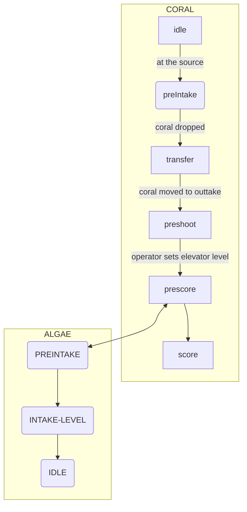

## States and Definitions

* coralHopper: hopperBeambreak
* coralOuttake: outtakBrsmbreak
    - elevatorPos: elevator position
* reefDetected: Outtake sees reef pole
* reefAligned: drivebase ends path at the reef
* Algae detected: Algae beambreak
    - algaemotor.velocity == 0
    - algaemotor.current >5

```mermaid
erDiagram
    PREINTAKE{
        bool coral_in_robot "false"
        bool rollers_running "true"
        **
        bool coralHopper "false"
        bool coralOuttake "false"
        string elevatorPos "INTAKE"
    }
    TRANSFER{
        bool coral_in_robot "true"
        bool rollers_running "true"
        **
        bool coralHopper "true"
        bool coralOuttake "false"
        string elevatorPos "INTAKE"
    }
    PRESHOOT{
        bool coral_in_robot "true"
        bool rollers_running "false"
        **
        bool coralHopper "false"
        bool coralOuttake "true"
        string elevatorPos "INTAKE"
        bool reefAlign "false"
    }
    C-PRESCORE {
        bool coral_in_robot "true"
        bool rollers_running "false"
        bool atReef "false"
        **
        bool coralHopper "false"
        bool coralOuttake "true"
        string elevatorPos "INTAKE"
        bool reefDetected "false"
        bool reefAlign "true"
    }
    SCORE {
        bool coral_in_robot "true"
        bool rollers_running "false"
        bool atReef "false"
        **
        bool coralHopper "false"
        bool coralOuttake "true"
        string elevatorPos "INTAKE"
        bool reefDetected "false"
        bool reefAlign "true"
    }
    APREINTAKE {
        bool algae_in_robot "false"
        bool rollers_running "false"
        **
        bool algaeDetected "false"
        string elevatorPos "ZERO"
        bool reefAlign "true"
    }
    INTAKE-LEVEL {
        bool algae_in_robot "false"
        bool rollers_running "true"
        **
        bool algaeDetected "false"
        string elevatorPos "LEVEL"
        bool reefAlign "true"
    }
    A-IDLE {
        bool algae_in_robot "true"
        bool rollers_running "false"
        **
        bool algaeDetected "true"
        string elevatorPos "ZERO"
        bool reefAlign "??"
    }
```



